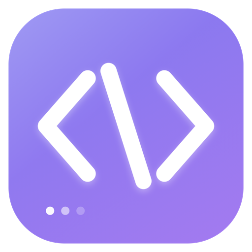
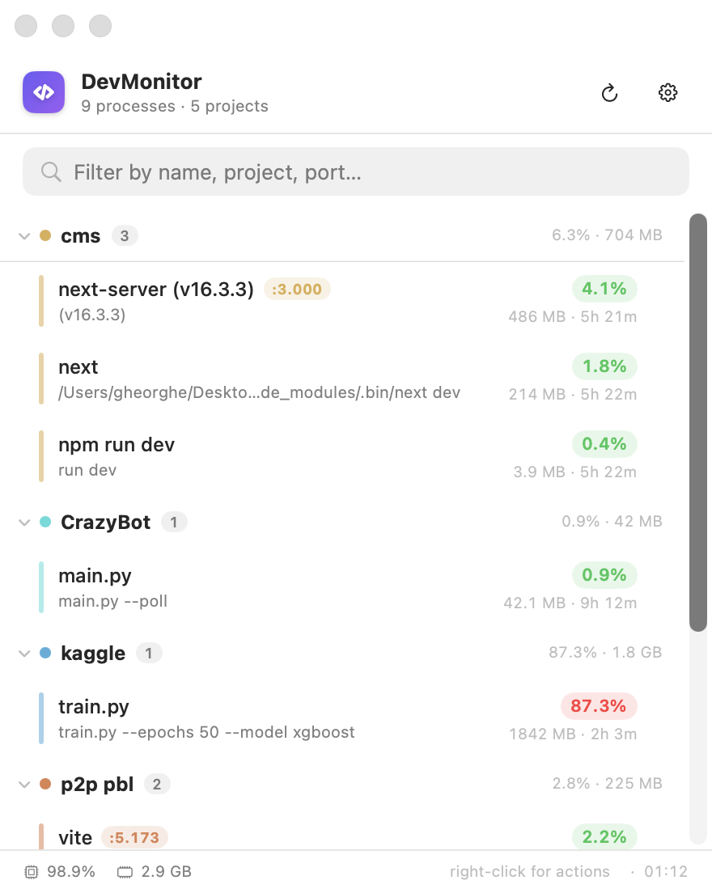
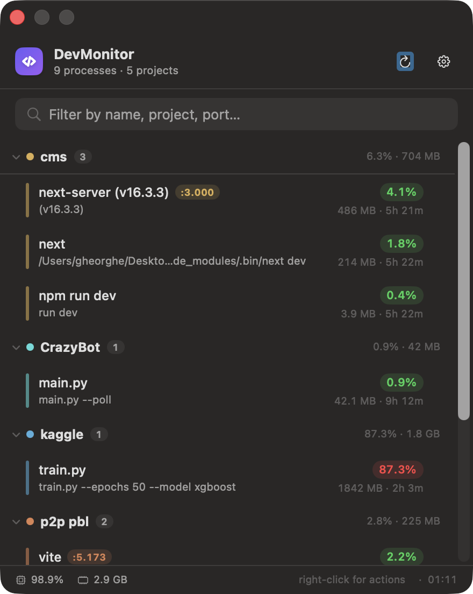
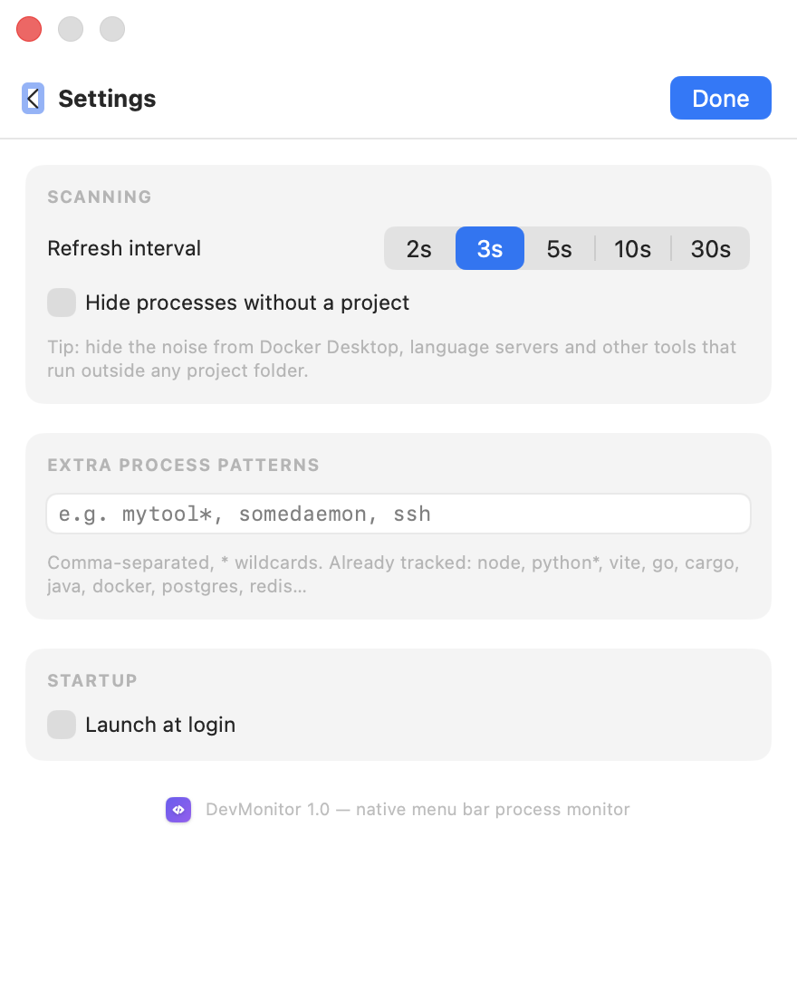
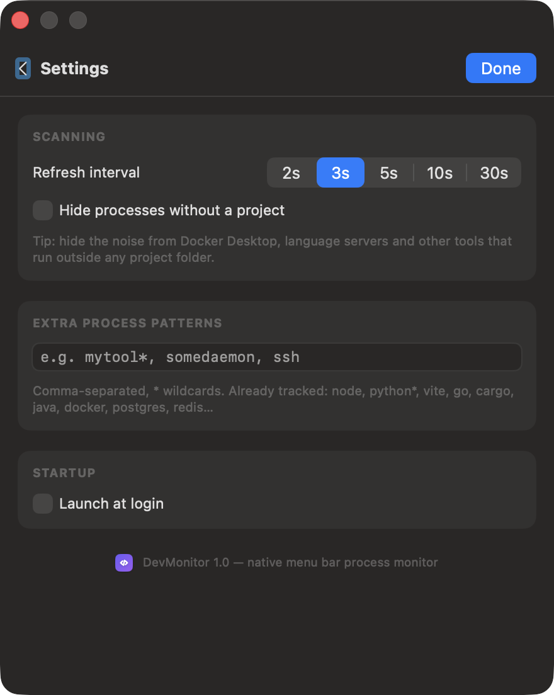

<div align="center">



# DevMonitor — macOS Menu Bar Process Monitor for Developers

**See every background dev process at a glance — grouped by project.**

Never lose track of a stray `node` dev server, a long `python` training run,
an orphaned Vite preview or a hungry Docker container again.

[](../../releases)
[](https://www.apple.com/macos/)
[](https://swift.org)
[](LICENSE)

</div>

<p align="center">
  
  
</p>

## The problem it solves

You work on many projects in parallel. Dev servers, watchers, notebooks,
training jobs and containers quietly pile up in the background — until the fan
spins up, a port is mysteriously taken, or 4 GB of RAM vanish into processes
you forgot existed. Activity Monitor shows you anonymous PIDs; DevMonitor
shows you **what's running, from which project, on which port, and at what
cost** — one click away in your menu bar.

## Features

- **📊 Live counter in the menu bar** — the `</> N` badge always shows how many
  dev processes are running.
- **📁 Grouped by project** — each process is attributed to its working
  directory, so you instantly know *which repo* that `node` process belongs to.
- **🔌 Listening ports** — see `:3000`, `:5173`, `:8080` badges next to the
  process that owns them. No more "port already in use" roulette.
- **🖥 Real resource usage** — *instantaneous* CPU (not the lifetime average
  `ps` reports), memory and uptime for every process, plus per-project and
  global totals.
- **🔍 Instant search** — filter by process name, project, command line or port.
- **⚡️ One-click actions** (right-click any process): Kill (SIGTERM),
  Force Kill (SIGKILL), Copy Full Command, Open Project Folder.
- **🧰 Broad tool coverage out of the box** — Node/npm/pnpm/Yarn/Vite/
  webpack, Python/uvicorn/gunicorn/celery/jupyter, Go, Rust/cargo, JVM/gradle,
  PHP, Ruby, Docker engine, redis, postgres, mysql, mongodb, nginx, caddy…
  plus your own custom patterns (`mytool*`).
- **🪶 100% native & lightweight** — a tiny Swift/SwiftUI `MenuBarExtra` app,
  no Electron, no helpers, ~0.4% CPU. Works with Command Line Tools only —
  Xcode not required.

<p align="center">
  
  
</p>

## Install

### Download (recommended)

1. Grab `DevMonitor.app.zip` from the latest [release](../../releases)
   (universal binary — Apple Silicon & Intel, macOS 13+).
2. Unzip and move `DevMonitor.app` to `/Applications`.
3. Open it once — the `</> N` item appears in your menu bar.
4. Optional: enable **Launch at login** in the app's settings.

> First launch note: the app is ad-hoc signed. If macOS Gatekeeper asks,
> right-click the app → *Open*, or allow it in *System Settings → Privacy & Security*.

### Build from source

```bash
git clone https://github.com/dobyody/macos_process_monitor.git
cd macos_process_monitor
./build.sh          # swift build + .app bundle + ad-hoc codesign
open DevMonitor.app
```

Requires only Apple's Command Line Tools (`xcode-select --install`).

## Usage

- Click the `</> N` menu bar item → all dev processes, grouped by project.
- Click a group header to collapse/expand it.
- Type in the filter box to search by name, project, port or command.
- **Right-click a process** → Kill / Force Kill / Copy Full Command /
  Open Project Folder.
- Gear icon → settings: refresh interval, extra process patterns
  (e.g. `ssh`, `mytool*`), hide processes without a project, launch at login.
- Debug in your terminal: `DevMonitor.app/Contents/MacOS/DevMonitor --scan`
  prints the full detection table.

## How it works

| What | How |
|---|---|
| Process discovery | one `ps` call per refresh, current user only — no sudo |
| Matching | executable name patterns (`node`, `python*`, `go`, `docker`, …), wildcard support |
| Project attribution | real working directory of each PID via the native `proc_pidinfo` API |
| Real exec path | `proc_pidpath` — immune to `process.title` renaming (e.g. `next-server`) |
| Ports | `lsof -iTCP -sTCP:LISTEN`, mapped to PIDs |
| CPU % | deltas of kernel task-info between refreshes → instantaneous usage |
| Memory / uptime | `ps` RSS and elapsed time |

The scan runs on a background queue every 3 seconds (configurable 2–30 s);
the UI never blocks.

## FAQ

**Does it require any permissions?**
No. It only reads information about your *own* processes — no Accessibility,
no Screen Recording, no admin rights.

**Does it kill random processes?**
Only when you explicitly ask: kill actions are in a per-process context menu,
never a single click on the row.

**Does it show processes from other users / system daemons?**
No — only your own processes, so the list stays relevant.

**Is there an Intel build?**
The release zip is a universal (arm64 + x86_64) binary.

## Contributing

PRs welcome — especially additional process patterns you rely on.
Dev loop:

```bash
swift build && ./.build/debug/DevMonitor --scan   # CLI detection table
./build.sh && open DevMonitor.app                 # full app
```

## License

[MIT](LICENSE) © 2026 dobbyody
